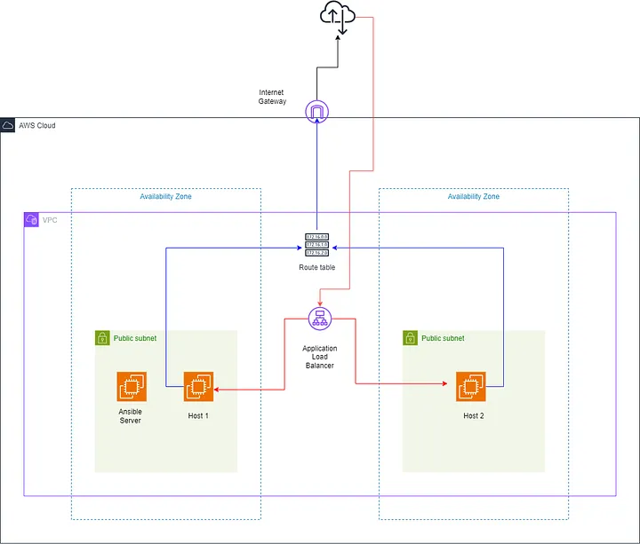

Vamos a montar esta arquitectura con Terrarom + Ansible.

Para poder lanzarlo:

    - Abrir terminal - .\terraform\env\us-west-2\dev
        - terraform init
        - terraform apply
              - Te va a pedir 2 valores de claves kms escribelos en terminal. Lo que quieras password random.
  
    - Ansible se instala solo, te va a lanzar el deploy de dev. El resto de entornos no estan hechos.
